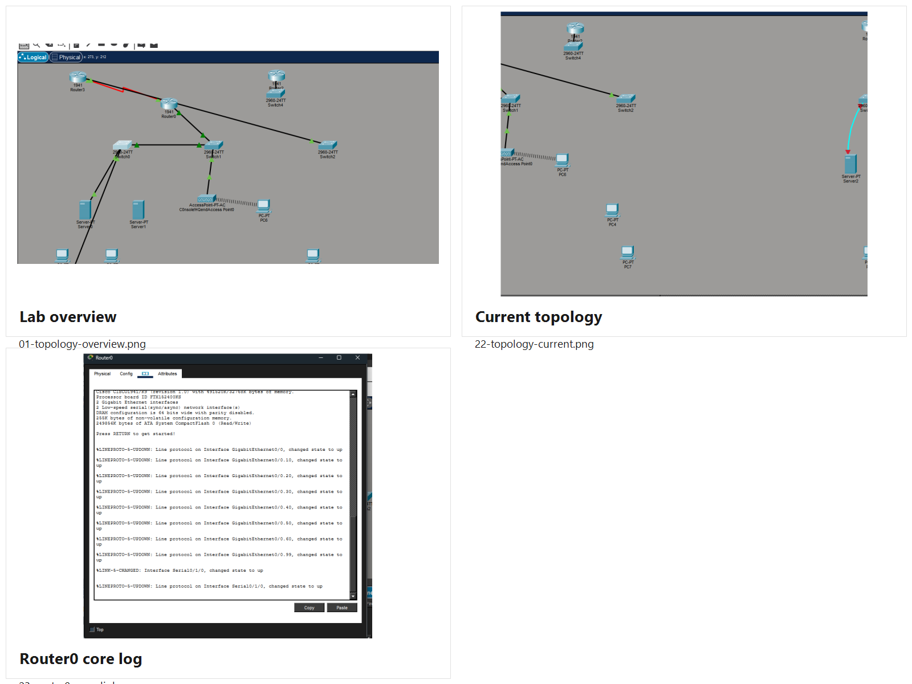

# Secure 3-Site Packet Tracer Lab

This repository has a Cisco Packet Tracer lab for my cybersecurity portfolio. I used a fictional company so I could build a realistic network without tying it to a real business.

## What is included

- 3 sites: HQ, Branch, and DR
- VLAN segmentation for users, guests, servers, and management
- Inter-VLAN routing with router-on-a-stick
- OSPF between all sites
- DHCP pools for each user network
- NAT/PAT at the HQ edge
- ACLs for guest isolation and department restrictions
- SSH-only device management
- Switch port security and unused-port shutdown
- Internet simulation through an ISP router and public server

## Folder guide

- `docs/topology.md` - network story and topology diagram
- `docs/ip-plan.md` - VLANs, subnets, gateways, and host addressing
- `docs/security-controls.md` - control-by-control security summary
- `docs/build-steps.md` - Packet Tracer build order
- `docs/services.md` - DNS, web, and Wi-Fi service settings
- `docs/verification.md` - screenshot map and expected results
- `docs/portfolio-writeup.md` - short portfolio summary
- `docs/portfolio-visuals.md` - diagrams and charts for the project
- `docs/project-status.md` - quick status page
- `docs/evidence-guide.md` - screenshot guide
- `docs/test-results.md` - test results and screenshots
- `evidence/` - screenshots and exported proof
- `configs/` - IOS configs for each router and switch
- `cybersecurity-portfolio-lab.pkt` - the live Packet Tracer save file for this lab

## Current status

- The repo includes the Packet Tracer save file, device configs, service settings, and screenshots.
- `docs/test-results.md` lists the screenshots and what each one shows.
- `docs/project-status.md` gives a short status summary.
- `evidence/` contains the screenshots used in the docs.

## Quick scan

| Area | Details |
| --- | --- |
| Sites | HQ, Branch, DR |
| Security controls | VLANs, OSPF, DHCP, NAT/PAT, ACLs, SSH, port security |
| Proof in repo | Config merge dialogs, service pages, live link-state, VLAN state, server addressing, live topology, router logs |

## Technical snapshot

| Control | What it shows |
| --- | --- |
| VLANs | User, guest, server, and management traffic are separated. |
| OSPF | The sites can route to each other without a flat network. |
| DHCP | End-user devices can get addresses without manual setup. |
| NAT/PAT | Internal networks can reach the internet simulation through the edge. |
| ACLs | Guest and department access is limited on purpose. |
| SSH | Management access is secured instead of using Telnet. |
| Port security | Access ports are hardened against unknown devices. |

## What it shows

This project is set up as a security and networking lab, not just a basic Packet Tracer build. The main idea is:

- guests are isolated from internal systems
- departments are segmented
- only approved users can manage network devices
- branch and DR sites are reachable through controlled routing
- live config imports, service pages, interface/VLAN state, and link-state screenshots show the build

## Project title

`Secure Multi-Site Enterprise Network with Segmentation and Access Control`

## How to use it

1. Review the topology in `docs/topology.md`.
2. Check the IP plan in `docs/ip-plan.md`.
3. Review the configs in `configs/`.
4. Compare the screenshot map in `docs/verification.md` with the results in `docs/test-results.md`.
5. Open the screenshots in `evidence/`.
6. Use `docs/project-status.md` as the repository status summary.
