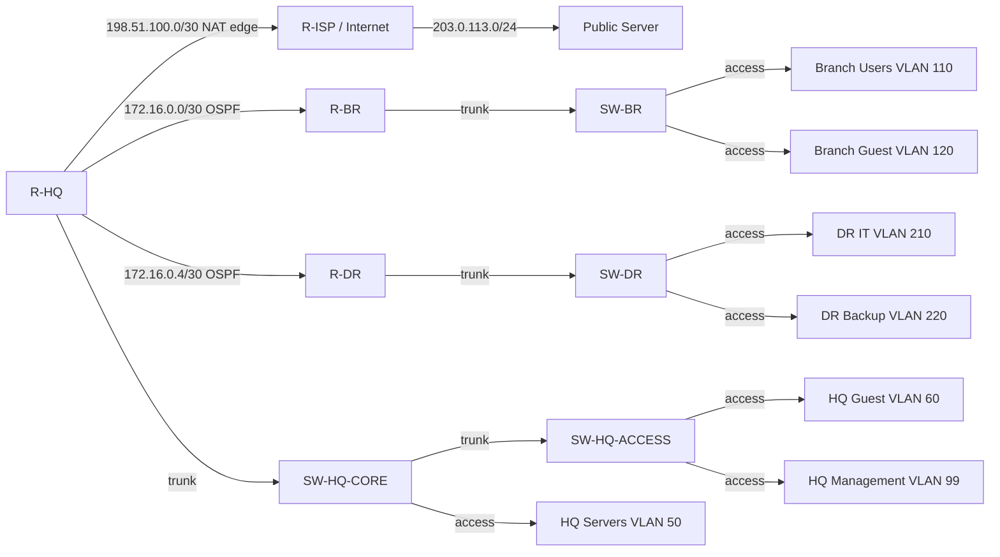
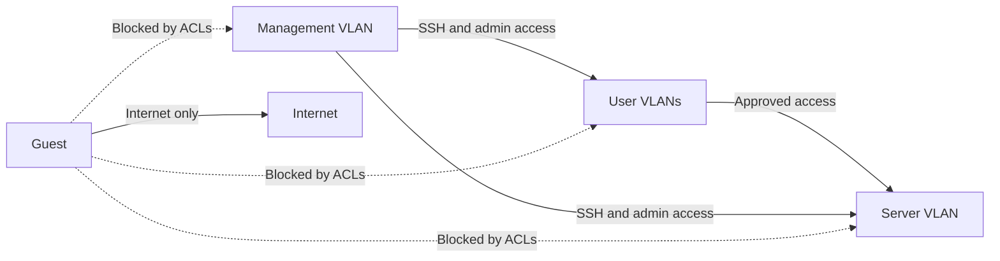
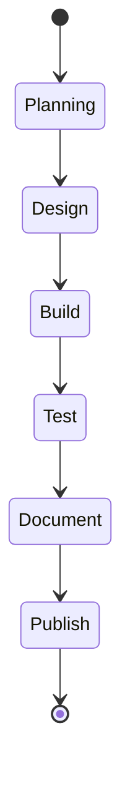
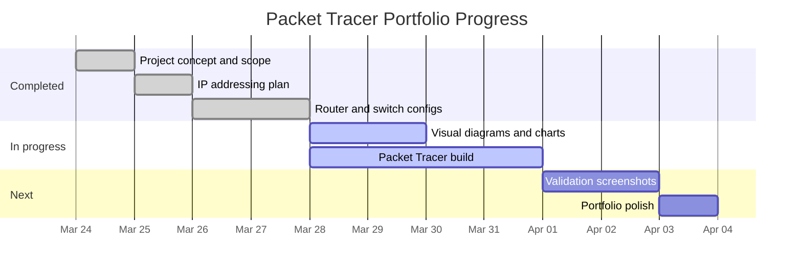

# Portfolio Visuals

This page collects the diagrams and charts I use to explain the project.

## Network topology

```mermaid
flowchart LR
  ISP["R-ISP / Internet"]
  HQR["R-HQ"]
  BRR["R-BR"]
  DRR["R-DR"]
  HQC["SW-HQ-CORE"]
  HQA["SW-HQ-ACCESS"]
  BRS["SW-BR"]
  DRS["SW-DR"]
  PUB["Public Server"]
  HQS["HQ Servers VLAN 50"]
  HGG["HQ Guest VLAN 60"]
  HQM["HQ Management VLAN 99"]
  BRU["Branch Users VLAN 110"]
  BRG["Branch Guest VLAN 120"]
  DRI["DR IT VLAN 210"]
  DRB["DR Backup VLAN 220"]

  HQR -->|"198.51.100.0/30 NAT edge"| ISP
  ISP -->|"203.0.113.0/24"| PUB
  HQR -->|"172.16.0.0/30 OSPF"| BRR
  HQR -->|"172.16.0.4/30 OSPF"| DRR
  HQR -->|"trunk"| HQC
  HQC -->|"trunk"| HQA
  HQC -->|"access"| HQS
  HQA -->|"access"| HGG
  HQA -->|"access"| HQM
  BRR -->|"trunk"| BRS
  BRS -->|"access"| BRU
  BRS -->|"access"| BRG
  DRR -->|"trunk"| DRS
  DRS -->|"access"| DRI
  DRS -->|"access"| DRB
```

## Security zones

```mermaid
flowchart LR
  G["Guest"]
  U["User VLANs"]
  S["Server VLAN"]
  M["Management VLAN"]
  I["Internet"]

  G -->|"Internet only"| I
  U -->|"Approved access"| S
  M -->|"SSH and admin access"| U
  M -->|"SSH and admin access"| S
  G -. "Blocked by ACLs" .-> U
  G -. "Blocked by ACLs" .-> S
  G -. "Blocked by ACLs" .-> M
```

## Project workflow

```mermaid
stateDiagram-v2
  [*] --> Planning
  Planning --> Design
  Design --> Build
  Build --> Test
  Test --> Document
  Document --> Publish
  Publish --> [*]
```

## Build progress

```mermaid
gantt
  title Packet Tracer Portfolio Progress
  dateFormat  YYYY-MM-DD
  axisFormat  %b %d

  section Completed
  Project concept and scope      :done, scope, 2026-03-24, 1d
  IP addressing plan             :done, ipplan, 2026-03-25, 1d
  Router and switch configs      :done, configs, 2026-03-26, 2d

  section In progress
  Visual diagrams and charts     :active, visuals, 2026-03-28, 2d
  Packet Tracer build            :active, build, 2026-03-28, 4d

  section Next
  Validation screenshots         :validate, after build, 2d
  Portfolio polish               :polish, after validate, 1d
```

