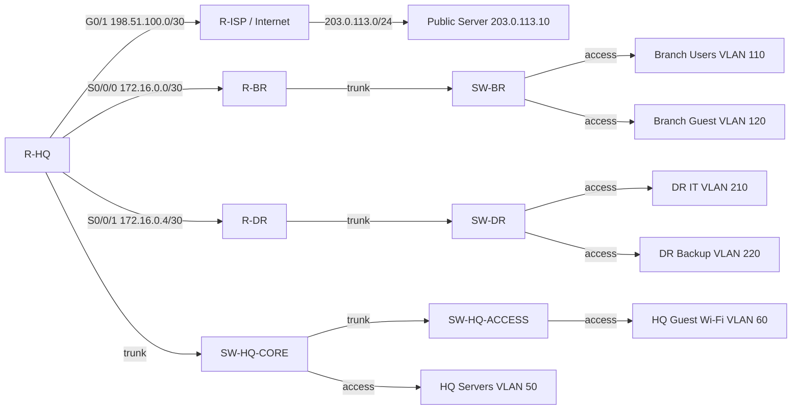

# Topology

## Fictional company

**Northstar Logistics** is the fictional company name used for the lab. It keeps the lab realistic without naming a real company. The setup has a headquarters, a branch office, and a disaster recovery site.

Main goals:

- keep guest traffic isolated
- stop unnecessary movement between departments
- secure management access
- keep public internet access controlled through the edge router

## Logical layout

## Device roles

- `R-HQ` - VLAN gateway, OSPF hub, NAT/PAT edge, ACL enforcement
- `SW-HQ-CORE` - server access and trunk aggregation
- `SW-HQ-ACCESS` - end-user access and guest Wi-Fi access
- `R-BR` - branch gateway and local DHCP
- `SW-BR` - branch access switch
- `R-DR` - disaster recovery site gateway and local DHCP
- `SW-DR` - DR access switch
- `R-ISP` - simulated internet edge
- `Public Server` - HTTP and DNS service for internet testing

## Security design choices

- `VLAN 10` admin
- `VLAN 20` HR
- `VLAN 30` finance
- `VLAN 40` IT
- `VLAN 50` servers
- `VLAN 60` guest wireless
- `VLAN 99` management

The branch and DR sites use their own VLAN ranges so the lab shows multi-site segmentation instead of one flat network.
